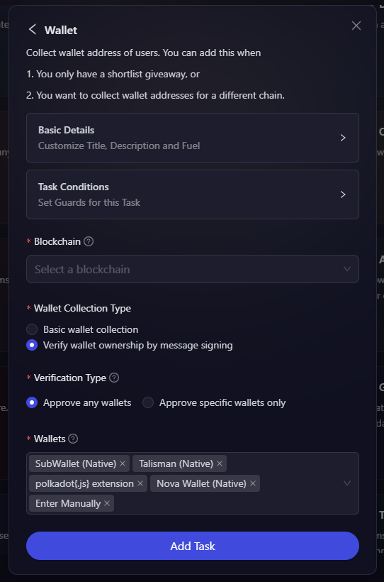

# Dotsama & EVM Wallet Tasks

Certain projects prefer manual distribution of rewards, or wants to distribute rewards later once your tokens/NFT go live. We understand that how difficult is it for the marketing an community team to manually collect these address on any chain and with that in mind, projects can create Wallet tasks at AirLyft in which participants during the time of event can collect wallet addresses of participant through MetaMask, Wallet Connect & more. Let's take a look at how to set up Wallet Tasks at AirLyft.

- Login to AirLyft and create an event. On the event page, click on select Apps tab where you can find the Wallet block. 

- Next, select the type of wallet address you want to collect from users. Currently we provide 2 options which is "EVM wallet address" and "Dotsama Wallet Address", but further development will be done so that projects can create wallet collect tasks for any blockchain. 

- Let's first select EVM Wallet address. Click on it and you will be provided with two input where firstly, you need to enter the basic details of task such as Title, Description, Entries. And the second input is to select the blockchain for which you want to verify and collect users public address. Once selected, click on Add Task to add this to your upcoming campaign.

- Moving towards collection of Dotsama Wallet Address. Click on it and you will be provided with two input where firstly, you need to enter the basic details of task such as Title, Description, Entries. And the second input is to select from the list of Dotsama parachains, sister chains from the list, for which you want to verify and collect users public address. Once selected, click on Add Task to add this to your upcoming campaign.

That's it... You can now automatically collect required public wallet addresses and use it to shortlist, distribute rewards, or anything.

:::tip This document is in progress, for instant help

1. Email us at support@kyte.one
2. Join [this Telegram group](https://t.me/kyteone): https://t.me/kyteone

**_The AirLyft Team is there to help you. AirLyft is a platform to run marketing events, campaigns, quests and automatically distribute NFTs or Tokens as rewards._**

:::