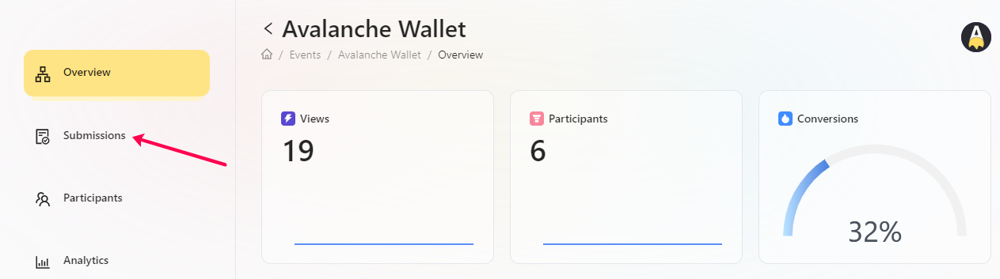
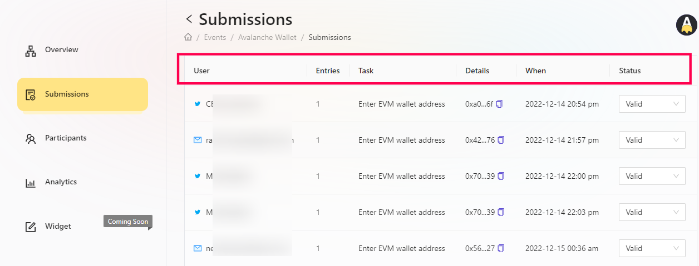

# Submission View

At times, projects in order to guage the performance of campaign needs to check participation data of ongoing events. With that in mind, we have built a submission view at AirLyft in which you can view task level breakdown of users, the number of entries they scored for that particular task, the status of their entry and other things. 

- Login to AirLyft and once you are on the dashboard, please click on events tab as shown in the screenshot below.

- After you are on the event page, select the corresponding event for which you want to check the participant data and click on View button. 

- You are now on the event overview page. Next step is to click on Submission tab where you can see all submitted data of your participants in a single page. 

- As seen in screenshot below, you can view all the submitted data such as their login method, their wallet addresses, their tasks completed, and every related parameters in a single view and then action upon it in case of discrepancies.

:::tip For instant help
1. Email us at support@kyte.one
2. Join our official [Telegram group](https://t.me/kyteone)
:::