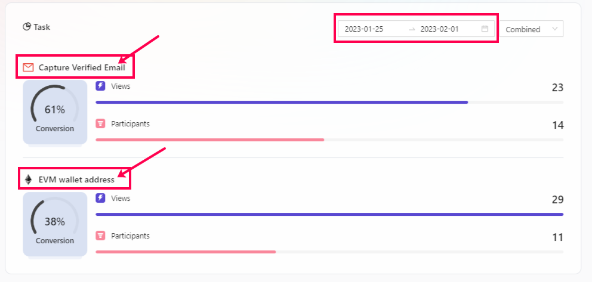

# Task-Level Analytics

One of the major points to consider during an ongoing event is to understand how your tasks are performing or what is the percentage of conversion of a particular task added in the event. It shows what percentage of users are willing to do the tasks and what percentage of users are not. Let's take a look at how you can view this data on AirLyft for your ongoing and already-settled campaign.  

- Login to AirLyft and once you are on the dashboard, please click on the events tab as shown in the screenshot below.

- After you are on the event page, select the corresponding event for which you want to check the task level conversion data and then click on the View button. 

- You will be redirected to the event overview page where you would be provided with different options. On the same overview page, you can find a section labeled **Task**. This is the section where you can view your Task Level Conversion data. If you take a look at the screenshot below, you can see there are two tasks available 
  
    - **Capture Verified Email**
    - **EVM Wallet Address**

In both these tasks, you can see the views, participants, and conversion percentage numbers. In the verified email task, there has been a total of 23 views out of which, only 14 users have participated which ensured 61% conversion of users on this task. The same logic applies to other tasks available in your campaign. 

- If you want to view the conversion data for a specific day, you can select the required date from the filter and AirLyft shows the conversion data based on your requirements.

:::tip For instant help
1. Email us at support@kyte.one
2. Join our official [Telegram group](https://t.me/kyteone)
:::