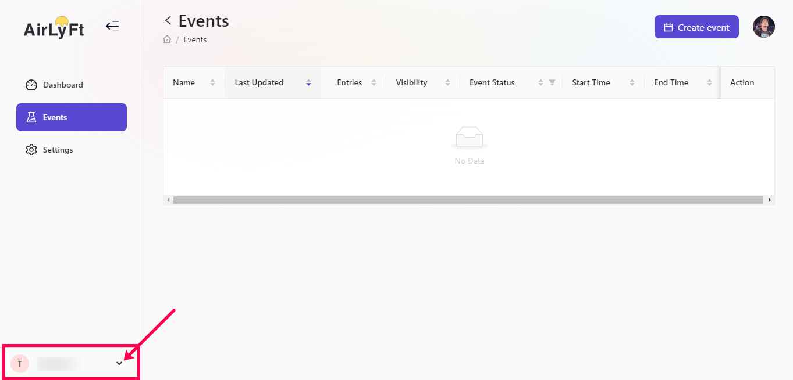
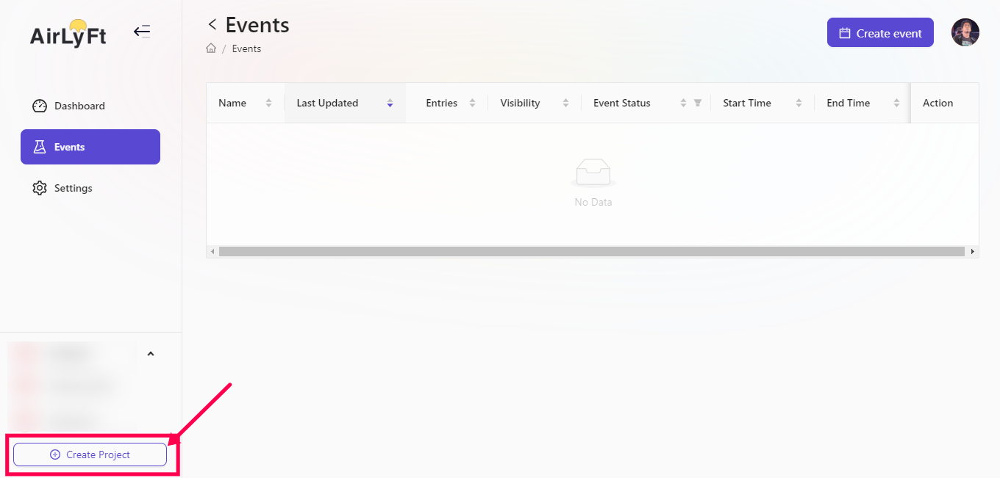
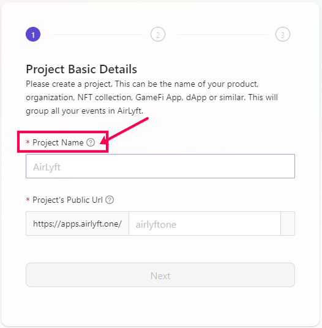
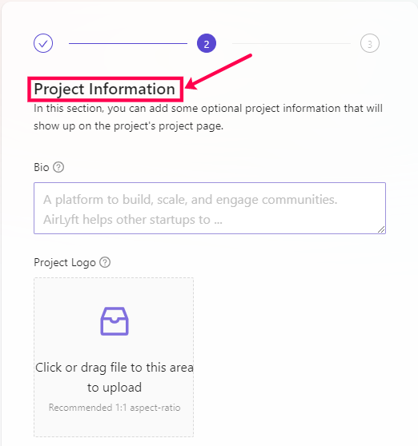
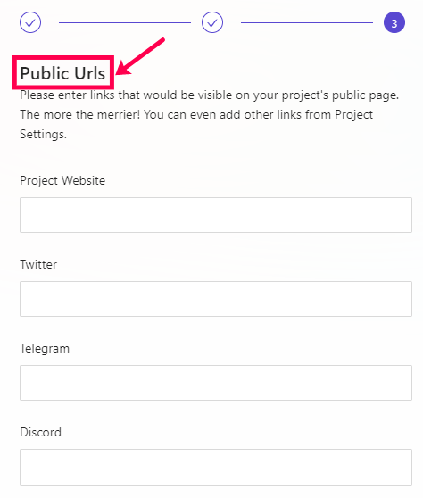

# Creating a new project
This tutorial focuses on how a project can create multiple sub projects within AirLyft. It is mostly seen that along with having a global channels, projects also have region specific channels and want to have regional events and not mix it up with events happening on global channels. Projects can simply create their regional sub projects and get things rolling. Let's dive deep into how to create a new project within AirLyft. 

- Firstly, login to your AirLyft account with which you have signed in earlier and go to your dashboard. 

- Next, headover to bottom left part of your screen where you can see your current created project. Click on the arrow mark as shown in screenshot below. 

- Upon clicking the arrow, you would see an option to create new project. Click on the Create Project button and you would be redirected to project details page. 

- On the Project Basic Details page, please enter project name and project public URL pertaining to the project you are trying to create. Once done, click on Next button. 

- Next step would be to enter project related information. If you don't have the details handy, you can always skip this towards the bottom of the page and enter these information later. 

- Next and final step is to enter the public URLs pertaining to the project or if you don't have the details handy, you can always skip this towards the bottom of the page and enter these information later.

And that's it... Your new project is created successfully at AirLyft. 

Should you have any questions regarding templates here, please feel free to drop a line at official channels below. 

**Official Email Address: support@kyte.one** 

**Official Telegram: https://t.me/kyteone**

LYFT OFF!!!  

