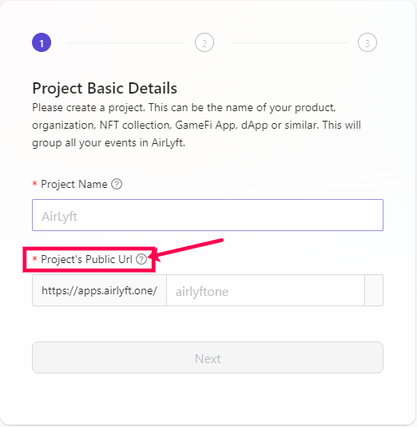
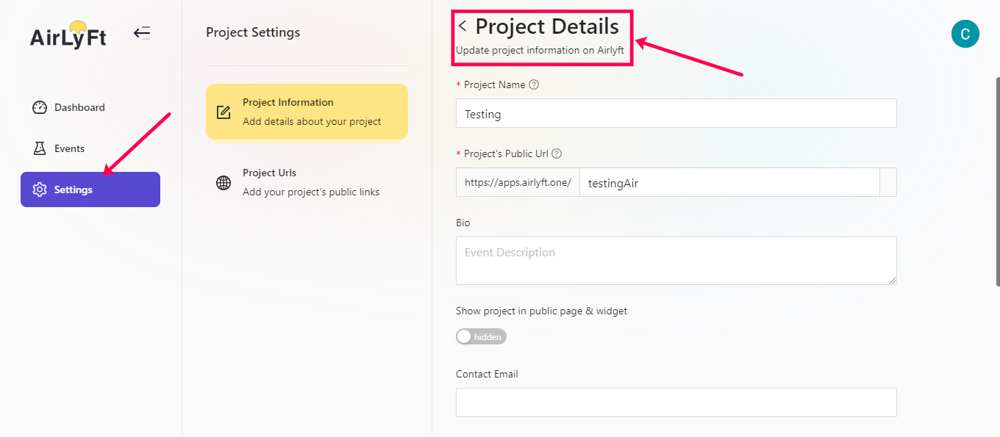

# Onboarding 

Now, that you have logged in successfuly into AirLyft, the next step is to fill in your onboarding details. We very clearly understand that how important your time is and have build an onboarding process which takes less than 2 minutes. 

* First step is to enter your project name. It is strongly advisable to keep this as your project name so that it becomes much easire for individuals to explore your project on AirLyft. 

* Once you have entered the project name, next step is to fill in your project URL. Enter the project URL carefully as this will be the link which users will use to access your project page at AirLyft. 
   

* Next step is to enter your project information which includes details such as Project’s Bio, Project Logo, Project Banner, and Contact Email. If you don’t have these details handy, you can always Skip and move to the next page but it is advisable that you have the details filled out at the time of onboarding. 

* Next step is to enter your public URLs as this would be embedded on your company’s profile page on AirLyft which will allow anyone to quickly access your project website, Twitter, Telegram, Discord, Youtube, and facebook pages. If you want to fill in this later, just click on Done and move forward. 
  

Once you have filled in all the details, you will get a confirmation of project created and will redirect you to your AirLyft Dashboard. When you have all the details handy, please click on the Settings button as shown in the screenshot below where you can fill in all the details as asked earlier. 

Should you face any issues or have any queries on onboarding process, please feel free to reach out to us on our

Official Email: support@kyte.one

Official Telegram: https://t.me/kyteone

Lyft Off!!!  