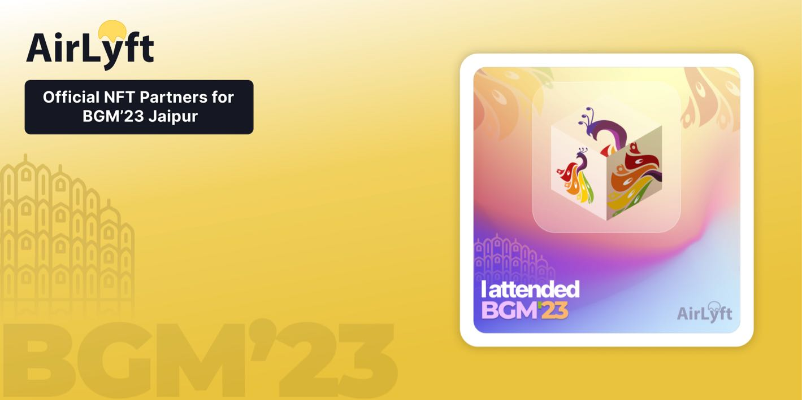

# BITSAA BGM'23

AirLyft is happy to be the official NFT Partner for Bits Pilani Alumni Association's Global Meet 2023 in Jaipur. AirLyft's technology is being used to create & distribute Official BGM NFTs to the delegates.

[Click here or on Next](faq) & let's go ahead to understand what is an NFT, and what do you need to do to claim your FREE BGM'23 COMMEMORATIVE NFT.

:::tip Stuck somewhere?

1. Visit the AirLyft team at stall G28 during BGM'23
2. Email us at support@kyte.one
3. Join [this Whatsapp group](https://chat.whatsapp.com/KSBWRBfGvKq95Lp6tXc8eN): https://chat.whatsapp.com/KSBWRBfGvKq95Lp6tXc8eN

**_The AirLyft Team is there to help you. AirLyft is a platform to run marketing events, campaigns, quests and automatically distribute NFTs or Tokens as rewards._**

:::

