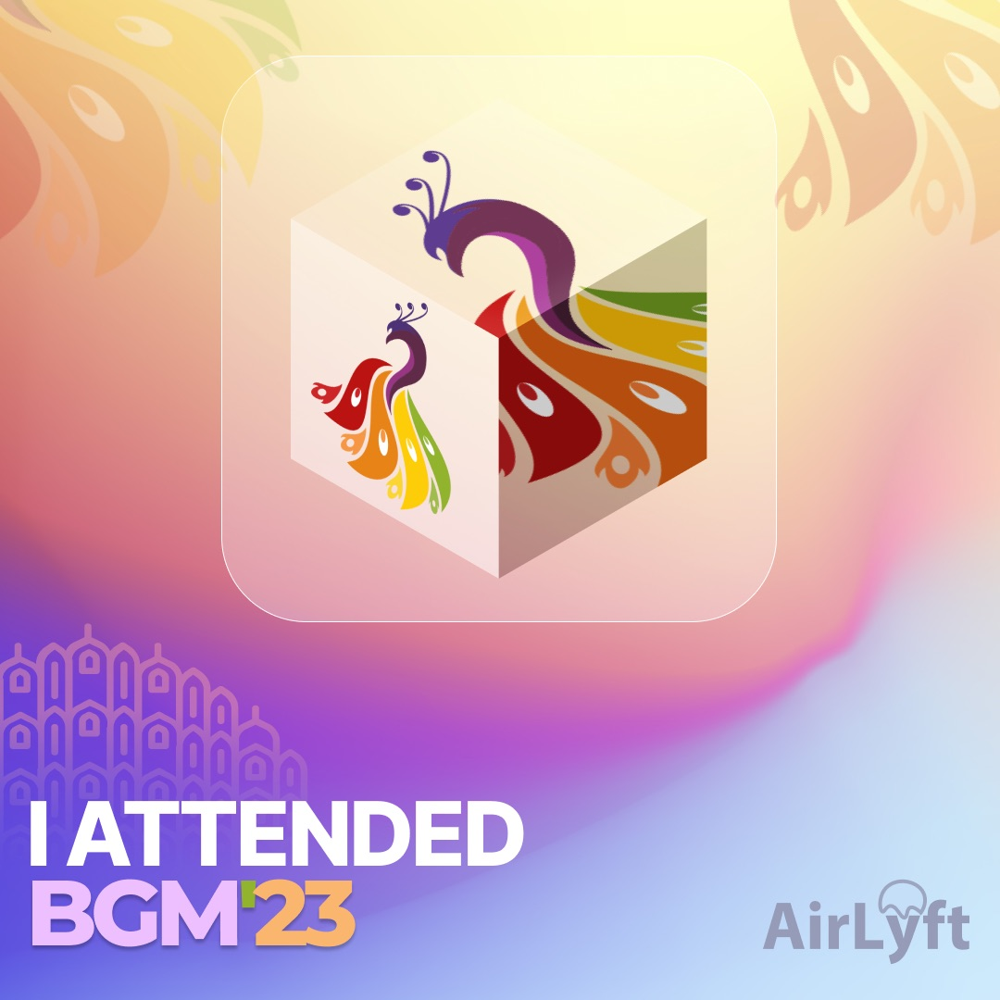

# BITSAA BGM'23

AirLyft is happy to be the official NFT Partner for Bits Pilani Alumni Association's Global Meet 2023 in Jaipur. Read along to **claim your BGM'23 NFT Today!** Own this digital asset & create an on-chain, decentralised proof that you attended BGM’23.

Let's start! [Go to the Next Page - "Part 1: Wallet Setup" or click here.](part1)

**Full Tutorial**
1. [Part 1: Wallet Setup](part1)
1. [Part 2: Claim NFT](part2)
1. [Part 3: View your NFT](part3)

Want to know more? Read some Frequently asked questions
1. [NFT FAQs](faq)
1. [Claim FAQs](claimfaqs)

:::tip Stuck somewhere?

1. Email us at support@kyte.one
2. Join [this Whatsapp group](https://chat.whatsapp.com/KSBWRBfGvKq95Lp6tXc8eN): https://chat.whatsapp.com/KSBWRBfGvKq95Lp6tXc8eN

**_The AirLyft Team is there to help you. AirLyft is a platform to run marketing events, campaigns, quests and automatically distribute NFTs or Tokens as rewards._**

:::