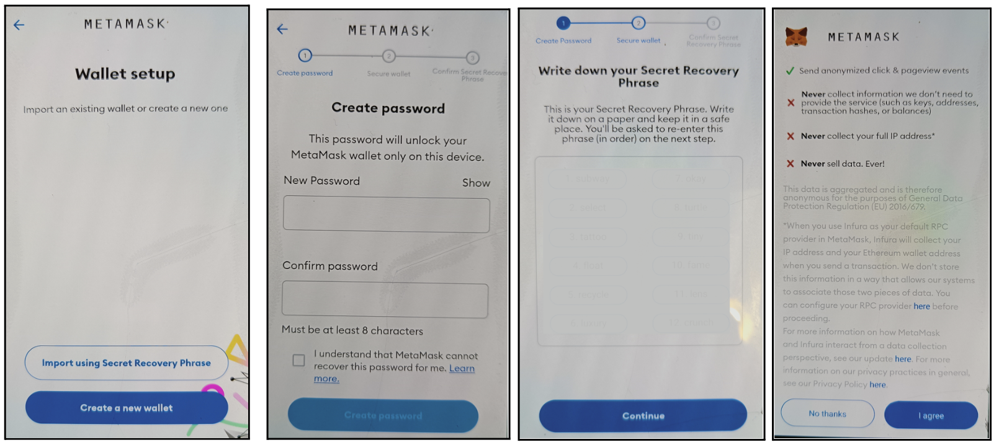
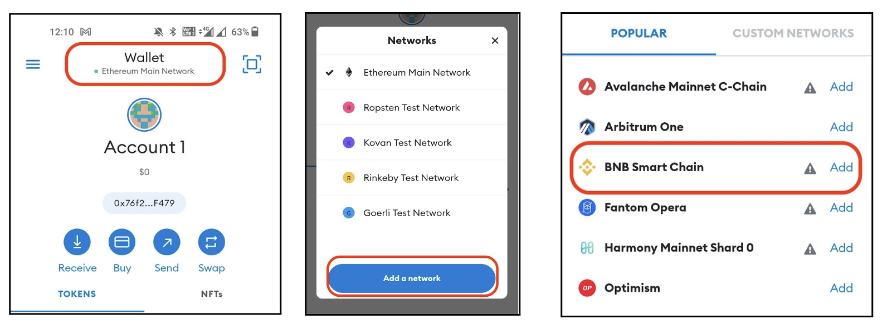
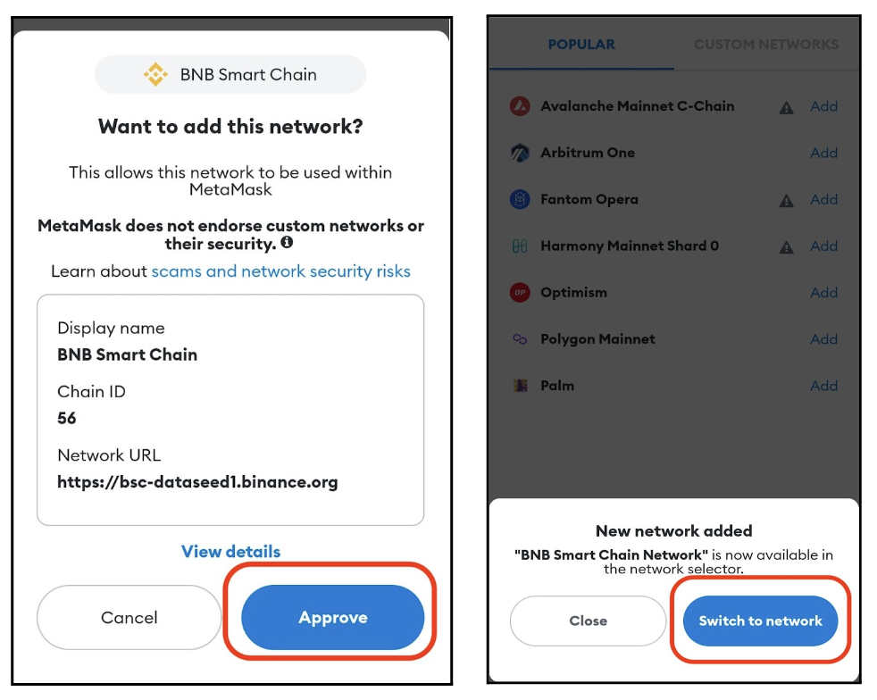

# Part 1: Wallet Setup
1. Download “Metamask” on your phone from Play Store or App Store (click here).
2. Open the downloaded app and click on “Create a new wallet” & create a password.
3. Then click on start and write down your Secret Recovery Phase _which you will need to enter again on the next page so please write it down carefully._ The next screen will ask you to enter the seed phrase again.

4. Reenter your password and click on **“I Agree”**
5. Now, click on the top of the screen on **“Wallet | Ethereum Mainnet”** and click on **“Add a network”**, select **“BNB Smart Chain”** from the list of networks

6. Click on **“Approve”** and then **“Switch to Network”**. 

[Go to the Next Page - "Part 2: Claim NFT" or click here.](part2)

**Full Tutorial**
1. [Part 1: Wallet Setup](part1)
1. [Part 2: Claim NFT](part2)
1. [Part 3: View your NFT](part3)

Want to know more? Read some Frequently asked questions
1. [NFT FAQs](faq)
1. [Claim FAQs](claimfaqs)

:::tip Stuck somewhere?

1. Email us at support@kyte.one
2. Join [this Whatsapp group](https://chat.whatsapp.com/KSBWRBfGvKq95Lp6tXc8eN): https://chat.whatsapp.com/KSBWRBfGvKq95Lp6tXc8eN

**_The AirLyft Team is there to help you. AirLyft is a platform to run marketing events, campaigns, quests and automatically distribute NFTs or Tokens as rewards._**

:::