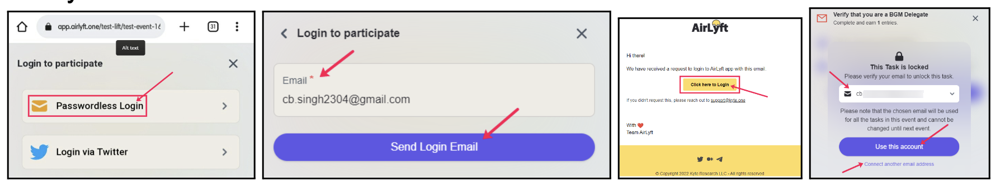
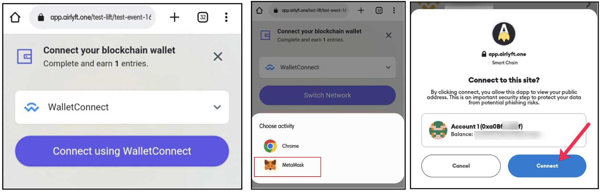
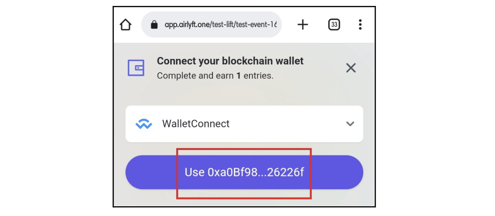

# Part 2: Claim NFT
1. Go to  https://app.airlyft.one/bgm/23.
2. Click on **“Verify that you are a BGM Delegate”**, and login. Select **“Passwordless Login”** and enter your email address.
3. Now, check your email address (check spam folder too). In the email select **“Click here to login”**.
4. Now click on **“Verify that you are a BGM Delegate”** and then select the email account with which you logged in on AirLyft, and click on Use this account, and then click on **“Verify”**.

5. Click on connect your blockchain wallet task. You can see the Wallet Connect if you are accessing it from the mobile device. Click on **“Connect”** and then **“Metamask”**.
6. Verify the network or connect to **BNB Smart Chain**.

7. After clicking on connect, you will then see that your wallet address has been fetched on AirLyft successfully. Click on the Use button and that’s it!
8. Once you have both tasks completed, the NFT will be sent automatically to your connected Metamask wallet address within the next 5–10 minutes.

[Go to the Next Page - "Part 3: View NFT" or click here.](part3)

:::tip Stuck somewhere?

1. Email us at support@kyte.one
2. Join [this Whatsapp group](https://chat.whatsapp.com/KSBWRBfGvKq95Lp6tXc8eN): https://chat.whatsapp.com/KSBWRBfGvKq95Lp6tXc8eN

**_The AirLyft Team is there to help you. AirLyft is a platform to run marketing events, campaigns, quests and automatically distribute NFTs or Tokens as rewards._**

:::