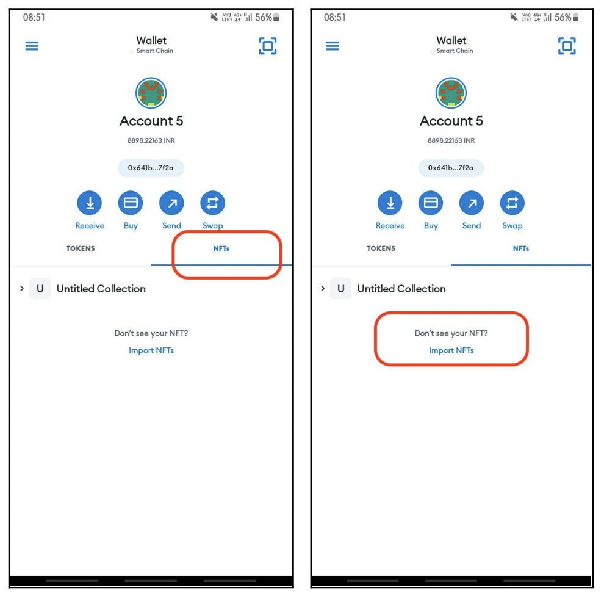
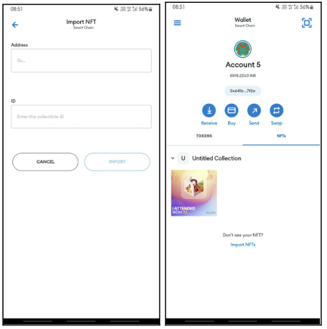

# Part 3: View NFT
1. To view your NFT, you need to Import it in Metamask.
2. Again open the metamask app and click on “NFTs” and then click on “Import NFTs”

3. You will get an option to enter two details “Address” and “ID”. Enter the following details:
- Address: 0x27eAcCBE4f5697911aD8Fd2c6EC1D36dc0953630
- ID: 0
4. That’s it! You will now be able to see the NFT in your wallet!

### Did you know?

You can view your NFTs in any NFT marketplace. The beauty of the technology does not bind you to any specific tool, technology or product. Which means even AirLyft or BGM will not have control over your NFT once you claim it. It is yours just like a physical object is yours once it's given to you. For this tutorial, we will use OpenSea to view your NFT.

Want to know more? Read some Frequently asked questions
1. [NFT FAQs](faq)
1. [Claim FAQs](claimfaqs)

:::tip Stuck somewhere?

1. Email us at support@kyte.one
2. Join [this Whatsapp group](https://chat.whatsapp.com/KSBWRBfGvKq95Lp6tXc8eN): https://chat.whatsapp.com/KSBWRBfGvKq95Lp6tXc8eN

**_The AirLyft Team is there to help you. AirLyft is a platform to run marketing events, campaigns, quests and automatically distribute NFTs or Tokens as rewards._**

:::