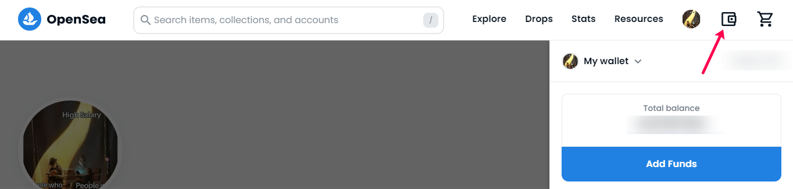
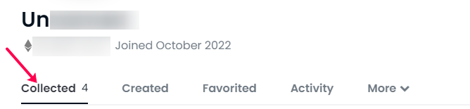

# View your NFT

You can view your NFTs in any NFT marketplace. The beauty of the technology does not bind you to any specific tool, technology or product. Which means even AirLyft or BGM will not have control over your NFT once you claim it. It is yours just like a physical object is yours once it's given to you. For this tutorial, we will use OpenSea to view your NFT.

### What is OpenSea?

OpenSea is a non-fungible token (NFT) marketplace where users can buy, sell, or create NFTs. It is a noncustodial platform, allowing users full control and access to their blockchain wallets where users interact directly with other users to buy or sell an NFT or a bundle of NFTs.

### How to see my owned NFTs at Opensea?

Checking owned NFTs at OpenSea is a 3 steps process. Please follow the steps below.

> **First, you need to install a decentralized wallet such as Metamask on your desktop or laptop or phone to get a blockchain address.**  

>**Secondly, head over to opensea and connect your wallet using the wallet option as shown in screenshot below.**  

>**Once the wallet is connected, you can click on your profile and check for all your collected and created NFTs.**

:::tip Stuck somewhere?

1. Visit the AirLyft team at stall G28 during BGM'23
2. Email us at support@kyte.one
3. Join [this Whatsapp group](https://chat.whatsapp.com/KSBWRBfGvKq95Lp6tXc8eN): https://chat.whatsapp.com/KSBWRBfGvKq95Lp6tXc8eN

**_The AirLyft Team is there to help you. AirLyft is a platform to run marketing events, campaigns, quests and automatically distribute NFTs or Tokens as rewards._**

:::
