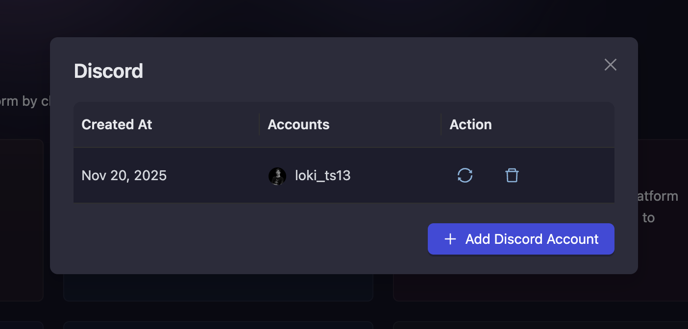
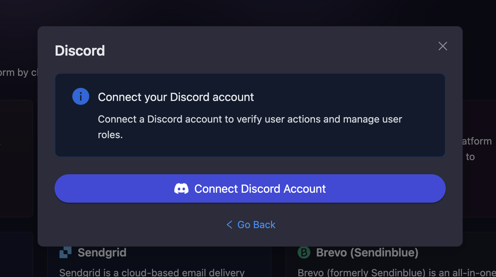

# Discord

Discord is a popular communication platform widely used by Web3 and gaming communities. The AirLyft-Discord integration allows you to verify user roles in your Discord servers, enabling you to create sophisticated campaign tasks that reward community members based on their Discord roles and server membership.

## Setting Up Discord Integration

The Discord integration enables role verification and server management features for your AirLyft campaigns. By connecting your Discord account, you can create tasks that check if users have specific roles or verify their server membership duration.

### Setting Up Discord Integration in AirLyft

Follow these steps to configure your Discord integration:

1. **Navigate to Integration Page**

   - Navigate to the Integration Page in your AirLyft dashboard.

     

2. **Select Discord**

   - Locate and click on the Discord integration block from the available options.

3. **Initialize Integration**

   - Click the "Add Discord Account" button to start the configuration process.

     

4. **Connect Your Discord Account**

   - Click the "Connect Discord Account" button to authorize AirLyft to access your Discord account.

   - You will be redirected to Discord's authorization page where you can grant the necessary permissions.

     

5. **Verification and Completion**

   - After successful authorization, your connected Discord account will be displayed in the integration page.

   - You can connect multiple Discord accounts by clicking "Connect Discord Account" again and repeating the authorization process.

   - Your Discord integration is now ready for use in campaign tasks.

## Using Discord Integration in Campaigns

Once your Discord account is connected, you can:

- Create tasks that verify if users have specific Discord roles
- Check if users are members of your Discord servers
- Verify how long users have been members of your server
- Set up role-based reward distribution

For detailed instructions on creating Discord tasks in your campaigns, refer to the [Discord Quest Guide](../campaign/quests/discord.md).

:::tip For instant help

If you are facing any issues with the Discord integration, please contact [support@airlyft.freshdesk.com](mailto:support@airlyft.freshdesk.com)!

1. Create a support ticket on our Discord: https://discord.gg/bx6ZCTwbYw
2. Join [this Telegram group](https://t.me/kyteone): https://t.me/kyteone

**_The AirLyft Team is there to help you. AirLyft is a platform to run marketing events, campaigns, quests and automatically distribute NFTs or Tokens as rewards._**

:::
