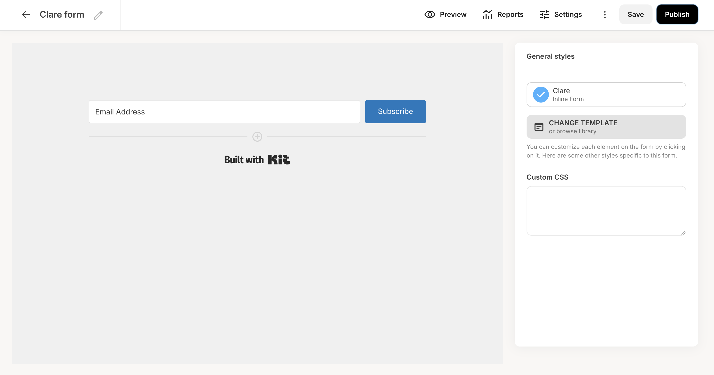
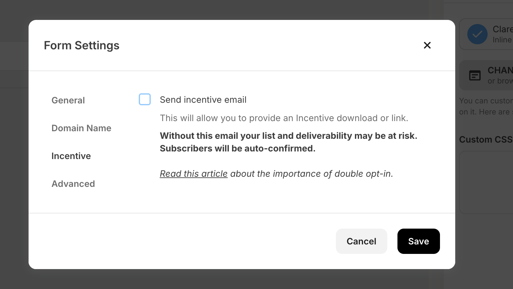
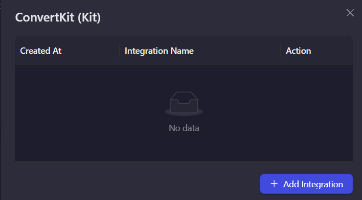
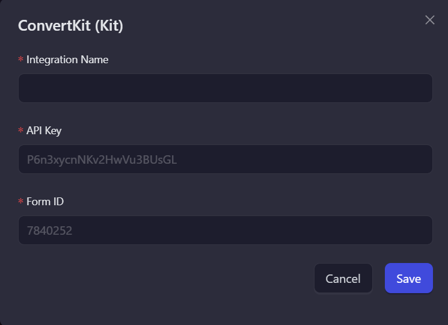
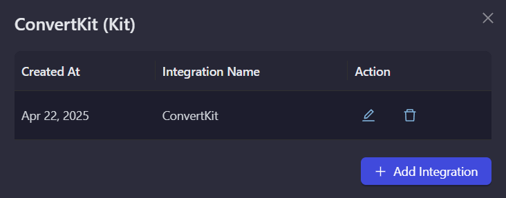

# ConvertKit (Kit)

ConvertKit is an email marketing tool that helps creators build and manage their audience. Use this integration to verify subscribers as part of your AirLyft campaign tasks.

## Setting Up ConvertKit Integration

To integrate ConvertKit with your AirLyft campaign, you'll need to obtain your API key and Form ID. Follow these steps:

### Obtaining your API Key:

- Log in to your ConvertKit account
- Click on the top right profile icon
- Select "Settings"
- Navigate to the "Developer" tab
- Generate a v3 API Key or copy your existing one

### Finding your Form ID:

- From your ConvertKit dashboard, click on the "Grow" dropdown tab
- Select "Landing Pages & Forms"
- Create a new form (Clear Form) with email input box only
- Save the form

- Go to the settings and then the "Incentive" tab
- Uncheck "Send incentive email" and check "Auto-confirm new subscribers"
- Save the settings

- Copy the Form ID from the URL: "app.convertkit.com/forms/designers/`7840253`/edit".

You can view all subscribers in your ConvertKit account by clicking on the "Grow" dropdown tab and then selecting "Subscribers".

### Setting Up ConvertKit Integration in AirLyft

Follow these steps to configure your ConvertKit integration:

1. **Access Integration Page**

   - Navigate to the Integration Page in your AirLyft dashboard.

     

2. **Select ConvertKit**

   - Locate and click on the ConvertKit integration block from the available options.

3. **Initialize Integration**

   - Click the "Add Integration" button to start the configuration process.

     

4. **Configure Integration Details**

   - Enter the following required information:

     - Integration Name: Provide a descriptive name for easy identification.
     - API Key: Enter your ConvertKit v3 API key.
     - Form ID: Input your ConvertKit Form ID.

       

5. **Verification and Completion**

   - Review your entered credentials.
   - Click "Save" to complete the integration setup.
   - Your ConvertKit integration is now ready for use in campaign tasks.

     

> Note: Double-check all credentials before saving to ensure proper connectivity with your ConvertKit account.

:::tip For instant help

If you are facing any issues with the ConvertKit integration, please contact [support@airlyft.freshdesk.com](mailto:support@airlyft.freshdesk.com)!

1. Create a support ticket on our Discord: https://discord.gg/bx6ZCTwbYw
2. Join [this Telegram group](https://t.me/kyteone): https://t.me/kyteone

**_The AirLyft Team is there to help you. AirLyft is a platform to run marketing events, campaigns, quests and automatically distribute NFTs or Tokens as rewards._**

:::
