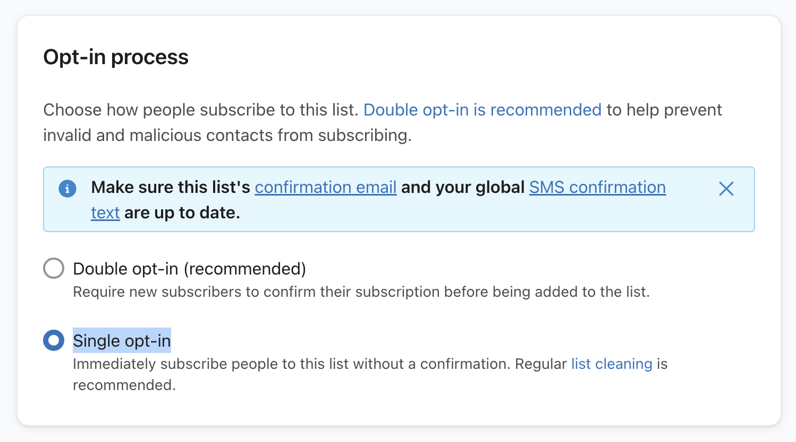
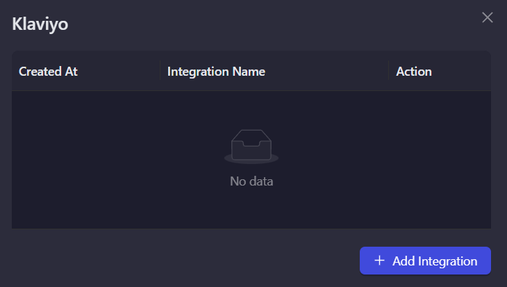
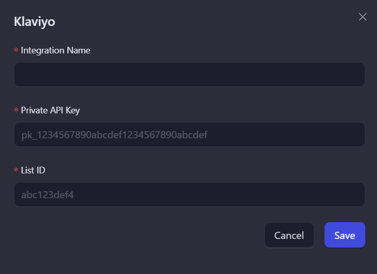
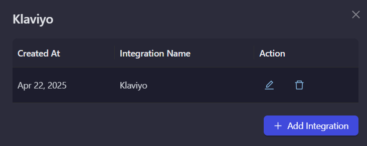

# Klaviyo

Klaviyo is a powerful email marketing platform that helps businesses create personalized customer experiences. Use this integration to verify subscribers as part of your AirLyft campaign tasks.

## Setting Up Klaviyo Integration

To integrate Klaviyo with your AirLyft campaign, you'll need to obtain your API key and List ID. Follow these steps:

### Obtaining your API Key:

- Log in to your Klaviyo dashboard
- Click on the button in the top right corner labeled "Account Plans"
- Navigate to "Account" → "API Keys"
- Generate a private API key

### Finding your List ID:

- From your Klaviyo dashboard, navigate to "Audience" then "Lists and Segments"
- Create a new list or use an existing one
- Open the list
- Navigate to "Settings" → "Consent"
- In "Opt-in process", select the "Single opt-in" option
- Your List ID can be found in the URL: "klaviyo.com/list/`Y5HSa4`"

You can view all subscribers by opening the list from the Audience section.

### Setting Up Klaviyo Integration in AirLyft

Follow these steps to configure your Klaviyo integration:

1. **Go to Integration Page**

   - Navigate to the Integration Page in your AirLyft dashboard.

     

2. **Select Klaviyo**

   - Locate and click on the Klaviyo integration block from the available options.

3. **Initialize Integration**

   - Click the "Add Integration" button to start the configuration process.

     

4. **Configure Integration Details**

   - Enter the following required information:

     - Integration Name: Provide a descriptive name for easy identification.
     - API Key: Enter your Klaviyo private API key.
     - List ID: Input your Klaviyo List ID.

     

5. **Verification and Completion**

   - Review your entered credentials.
   - Click "Save" to complete the integration setup.
   - Your Klaviyo integration is now ready for use in campaign tasks.

     

> Note: Double-check all credentials before saving to ensure proper connectivity with your Klaviyo account.

:::tip For instant help

If you are facing any issues with the Klaviyo integration, please contact [support@airlyft.freshdesk.com](mailto:support@airlyft.freshdesk.com)!

1. Create a support ticket on our Discord: https://discord.gg/bx6ZCTwbYw
2. Join [this Telegram group](https://t.me/kyteone): https://t.me/kyteone

**_The AirLyft Team is there to help you. AirLyft is a platform to run marketing events, campaigns, quests and automatically distribute NFTs or Tokens as rewards._**

:::
