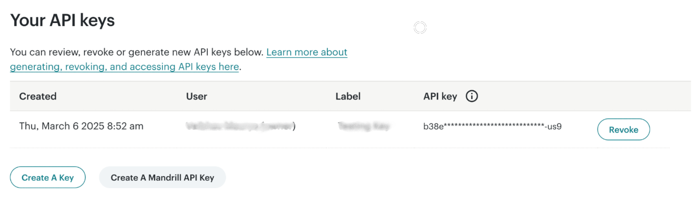
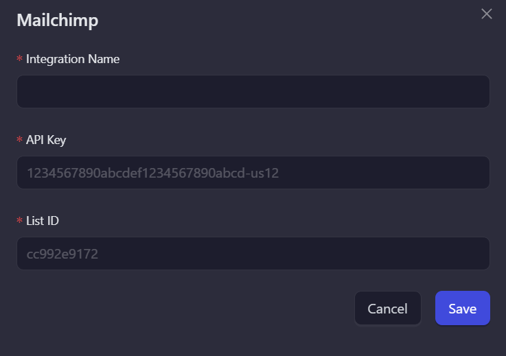

# Mailchimp

AirLyft has integrated with Mailchimp, one of the most popular email marketing platforms, to help you grow and engage your community. This integration allows you to verify if participants are subscribed to your mailing list as part of your campaign tasks.

## Setting Up Mailchimp Integration

To integrate Mailchimp with your AirLyft campaign, you'll need to obtain your API key and Audience ID. Follow these steps:

### Obtaining your API Key:

- Log in to your Mailchimp account
- Click on the top right profile icon
- Select "Account & Billing"
- Navigate to "Extras" and then "API Key"
- Generate a new API key or copy your existing one

### Finding your Audience ID:

- From your Mailchimp dashboard, navigate to the "Audience" tab
- Click on "All Contacts"
- Your Audience ID will be displayed on this page (it appears as a string of letters and numbers)

You can view all subscribers in your Mailchimp account under Audience → All Contacts.

### Creating the Mailchimp Integration

Follow these steps to set up your Mailchimp integration in AirLyft:

1. **Integration Page**

   - Navigate to the Integration Page in your AirLyft dashboard.

     

2. **Select Mailchimp**

   - Locate and click on the Mailchimp integration block.

3. **Initialize Integration**

   - Click the "Add Integration" button to begin the setup process.

     

4. **Configure Integration Details**

   - Enter the following required information:

     - Integration Name: Choose a descriptive name.
     - API Key: Paste your Mailchimp API key.
     - List ID: Enter your Mailchimp Audience ID.

       

5. **Completion**

   - Your Mailchimp integration is now ready to use.
   - You can utilize this integration when creating campaign tasks.

     

> Note: Ensure all credentials are entered correctly to avoid connection issues.

:::tip For instant help

If you are facing any issues with the Mailchimp integration, please contact [support@airlyft.freshdesk.com](mailto:support@airlyft.freshdesk.com)!

1. Create a support ticket on our Discord: https://discord.gg/bx6ZCTwbYw
2. Join [this Telegram group](https://t.me/kyteone): https://t.me/kyteone

**_The AirLyft Team is there to help you. AirLyft is a platform to run marketing events, campaigns, quests and automatically distribute NFTs or Tokens as rewards._**

:::
