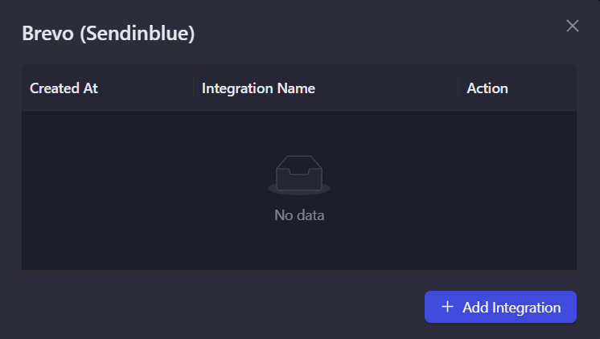

# Sendinblue (Brevo)

Sendinblue (now Brevo) is an all-in-one marketing platform that helps businesses connect with customers through email, SMS, and more. Use this integration to verify subscribers as part of your AirLyft campaign tasks.

## Setting Up Sendinblue Integration

To integrate Sendinblue with your AirLyft campaign, you'll need to obtain your API Key and List ID. Follow these steps:

### Obtaining your API Key:

- Log in to your Sendinblue dashboard
- Click on the top right profile icon, and select "SMTP & API" from the dropdown
- Navigate to the "API Keys" tab
- Generate a new API key

### Finding your List ID:

- Navigate to "Contacts" → "Lists"
- Create a new list or select an existing one
- On the lists tab, locate the ID of the created list

### Managing Subscribers

You can view all subscribers by clicking on a specific list to see all its members.

### Setting Up Sendinblue Integration in AirLyft

Follow these steps to configure your Sendinblue integration:

1. **Go to Integration Page**

   - Navigate to the Integration Page in your AirLyft dashboard.

     

2. **Select Sendinblue**

   - Locate and click on the Sendinblue integration block from the available options.

3. **Initialize Integration**

   - Click the "Add Integration" button to start the configuration process.

     

4. **Configure Integration Details**

   - Enter the following required information:

     - Integration Name: Provide a descriptive name for easy identification.
     - API Key: Enter your Sendinblue API key.
     - List ID: Input your Sendinblue List ID.

       

5. **Verification and Completion**

   - Review your entered credentials.
   - Click "Save" to complete the integration setup.
   - Your Sendinblue integration is now ready for use in campaign tasks.

     

Note: Double-check all credentials before saving to ensure proper connectivity with your Sendinblue account.

:::tip For instant help

If you are facing any issues with the Sendinblue integration, please contact [support@airlyft.freshdesk.com](mailto:support@airlyft.freshdesk.com)!

1. Create a support ticket on our Discord: https://discord.gg/bx6ZCTwbYw
2. Join [this Telegram group](https://t.me/kyteone): https://t.me/kyteone

**_The AirLyft Team is there to help you. AirLyft is a platform to run marketing events, campaigns, quests and automatically distribute NFTs or Tokens as rewards._**

:::
