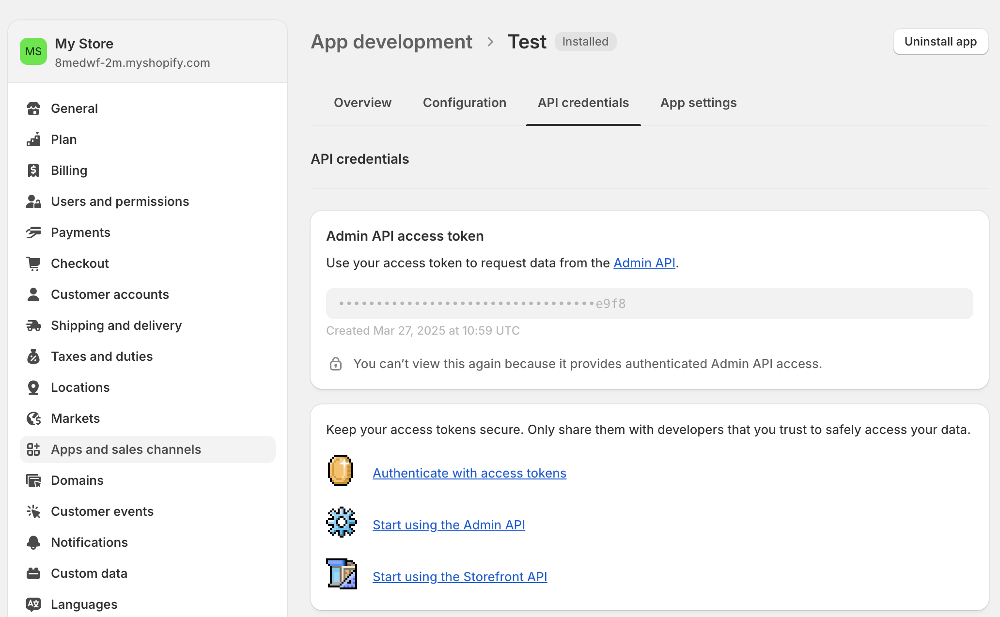

# Shopify

Shopify is a leading e-commerce platform that helps businesses create and manage online stores. Use this integration to verify your store's customers as part of your AirLyft campaign tasks.

## Setting Up Shopify Integration

To integrate Shopify with your AirLyft campaign, you'll need to obtain your Access Token and Store Name. Follow these steps:

### Obtaining your Access Token:

- Log in to your Shopify Admin dashboard at admin.myshopify.com
- In the bottom left corner, click on "Settings"
- From the settings menu, find and click "Apps and sales channels"
- Look for the "Develop apps" button and click it
- Click "Create an app" and give it a meaningful name (e.g., "AirLyft Integration")
- Once created, go to the "API credentials" section
- Look for "Admin API access token".

> - If it's not created, click "Configure Admin API Scopes"

> - In the permissions list, scroll to find the "Customers" section
> - Check both boxes:
>   ✓ "read_customers" (to verify customer data)
>   ✓ "write_customers" (to manage customer information)
> - Click "Save" to apply these permissions

> - Return to the "API credentials" tab
> - Look for the "Install App" button and click it
> - Confirm the installation when prompted

> - After installation, your Access Token will be displayed

- Copy this token.

### Finding your Store Name:

- In Settings, locate your profile where it shows "My store"
- Your store domain appears as "`8medwf-2m`.myshopify.com"
- The highlighted portion is your store name
- You can also find your store name in the URL: "admin.shopify.com/store/`8medwf-2m`"

### Managing Customers

You can view all your customers by navigating to the "Customers" tab on your Shopify dashboard.

### Setting Up Shopify Integration in AirLyft

Follow these steps to configure your Shopify integration:

1. **Access Integration Page**

   - Navigate to the Integration Page in your AirLyft dashboard.

     

2. **Select Shopify**
   .

   - Locate and click on the Shopify integration block from the available options.

3. **Initialize Integration**

   - Click the "Add Integration" button to start the configuration process.

     

4. **Configure Integration Details**

   - Enter the following required information:

     - Integration Name: Provide a descriptive name for easy identification.
     - Store Name: Enter your Shopify store name (e.g., '8medwf-2m').
     - Access Token: Enter your Shopify Admin API Access Token.

       

5. **Verification and Completion**

   - Review your entered credentials.
   - Click "Save" to complete the integration setup.
   - Your Shopify integration is now ready for use in campaign tasks.

     

Note: Double-check all credentials before saving to ensure proper connectivity with your Shopify store.

:::tip For instant help

If you are facing any issues with the Shopify integration, please contact [support@airlyft.freshdesk.com](mailto:support@airlyft.freshdesk.com)!

1. Create a support ticket on our Discord: https://discord.gg/bx6ZCTwbYw
2. Join [this Telegram group](https://t.me/kyteone): https://t.me/kyteone

**_The AirLyft Team is there to help you. AirLyft is a platform to run marketing events, campaigns, quests and automatically distribute NFTs or Tokens as rewards._**

:::
