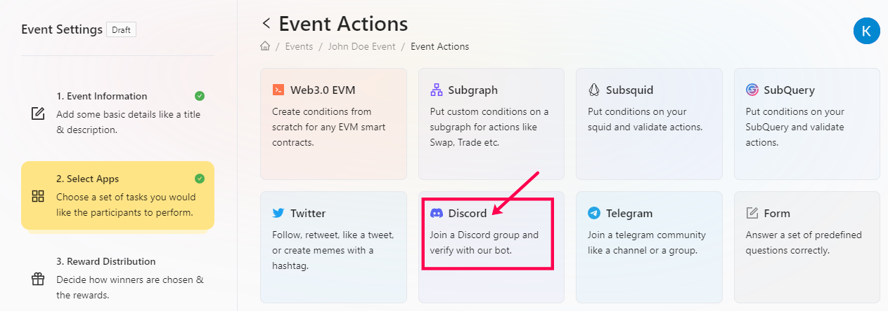
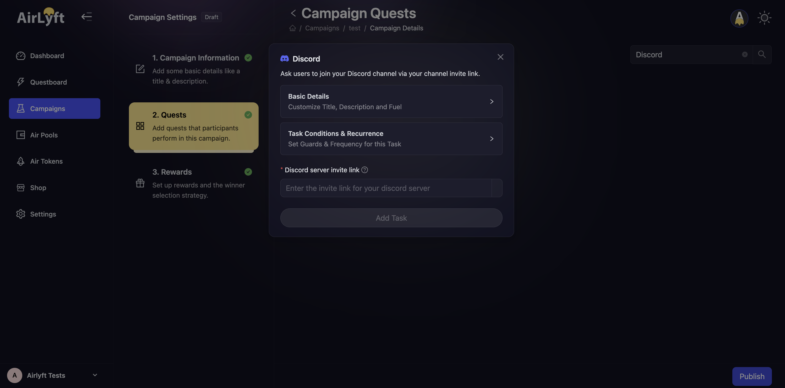
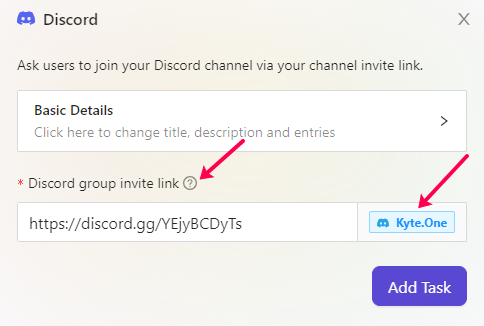

# Creating Discord Task

AirLyft now supports Discord integration to promote your discord server. You can create Discord based tasks to check if participants have joined your discord server or not. Please follow the steps below on how to create a Discord tasks.

- Login to AirLyft and create an event. On the event page, click on select Apps tab where you can find the discord block. 

- Click on the basic details option to enter the Title, Description and Entries. It is advisable to elaborate the title and description so that participants have a much greater understanding of task.

- After entering the basic details, enter your project's discord server invite link here. Please note that if your discord invite link is correct, AirLyft will auto populate the server it belongs to. Take a look at the screenshot below. 

If you are facing any issues with Discord task creation, please drop a line at ** support@kyte.one **!