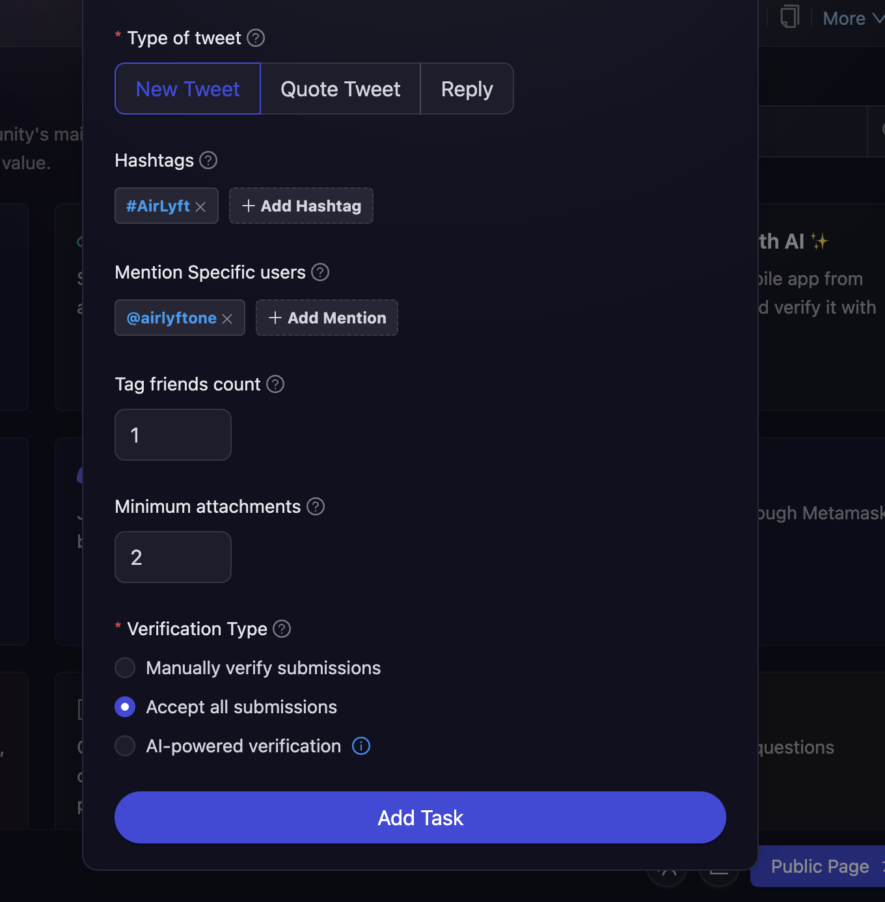
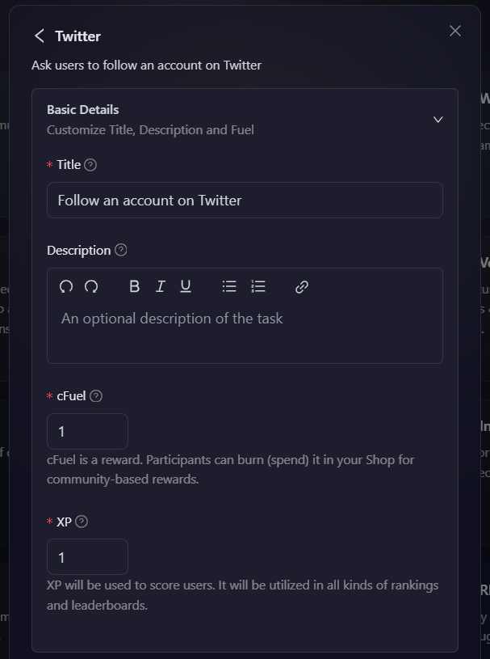

# Creating Twitter Tasks

Twitter is by far one of the most important social channel that probably any web 3 companies look forward to for building, scaling, and engaging their communities. With that in mind, we have integrated Twitter actions on AirLyft that projects can create action on and ask their community members to complete. In this module, we will be discussing below Twitter actions. 

- [Retweet a post on Twitter](#retweet-a-post-on-twitter)
- [Like a post on Twitter](#like-a-post-on-twitter)
- [Tweet Specific Content on Twitter](#tweet-specific-content-on-twitter)
- [Follow an account on Twitter](#follow-an-account-on-twitter)
- [User Generated Content on Twitter](#user-generated-content-on-twitter)

Creating these actions are very simple and straight forward at AirLyft. Let's dive deep into steps on how to create Twitter Actions on AirLyft.

- First Login onto AirLyft App, Create an event, and head over to Select Actions tab as shown in the screenshot below. 

- After clicking on the Twitter box, you will then be presented with options for selecting Twitter Actions. Let's read in depth about each of them. 

#### Retweet a post on Twitter

Follow these simple steps below on how to create retweet tasks on AirLyft. 

- As shown in screenshot above, click on the Twitter box where you can find the Retweet option. Click on it. 
- Next, click on the basic details option to enter the Title, Description and Entries. It is advisable to elaborate the title and description so that participants have a much greater understanding of task. 

- Now the only thing left is to enter the URL of tweet that you want your participants to retweet.

- Finally, click on Add Task Button and your Retweet task has been added successfully. 

#### Like a post on Twitter

- Like we did earlier, headover to Twitter box and now click on the Like option. 
- Next, click on the basic details option to enter the Title, Description and Entries. It is advisable to elaborate the title and description so that participants have a much greater understanding of task. 

- Now the only thing left is to enter the URL of tweet that you want your participants to Like.

- Finally, click on ** Add Task ** Button and your Like task has been added successfully. 

#### Tweet Specific Content on Twitter

Most of the times, projects wants user to post a specific content on Twitter pertaining to a certain release or upcoming events. For instance, let's suppose that a project XYZ is about to release a staking functionality in the month of January '23 and as a part of tasks, the project wants all its participants to tweet the below content on Twitter. 

> ** Hey!!! A new staking functionality will be live on XYZ App by January '23. #XYZ #Staking **

Hence, if projects wants users to post a specific content, they can use the Tweet Specific content functionality on AirLyft and the platform will validate if this particular specific content by posted by the participants or not. Please follow steps below on creating a Tweet Specific content task.

- Click on the Twitter Box where you can find the Tweet Specific Content option. 

- Next, click on the basic details option to enter the Title, Description and Entries. It is advisable to elaborate the title and description so that participants have a much greater understanding of task. 

- Moving forward, select the type of Tweet i.e. New Tweet, Quote Tweet, Reply. It means that, you are giving users the direction to reply a specific content in form of a New Tweet, or QT, or a simple reply.

- Now, say in certain cases, if you dont want users to write anything and just add Hashtags or mention Specific users, in that case, just enter the required Hashtag and users as shown in screenshot below. You can also find option to tag specific number of friends on the Tweet being sent out. 

- In another case, if you want users to post specific content, click on Tweet Specific Content toggle button and switch it on. You would be asked to add the text that you want your participants to tweet and tag any specific number of friends.

- Finally, click on the ** Add Task ** button to create this task. 

Based on the conditions set by the project, AirLyft will automatically verify if participants have actually posted the same content or not, or have they actually mentioned the hashtags, or they have mentioned 3 of their friends or not. Only if all the conditions have been carried out, points for this specific tasks will be awarded to the participants. 

#### Follow an account on Twitter

Follow these simple steps below on how to create follow a Twitter account task on AirLyft. 

- Headover to Twitter box and click on the Follow option. 
- Next, click on the basic details option to enter the Title, Description and Entries. It is advisable to elaborate the title and description so that participants have a much greater understanding of task. 

- Now the only thing left is to enter the URL of tweet that you want your participants to Like.

- Finally, click on ** Add Task ** Button and your Follow account task has been added successfully. 

#### User Generated Content on Twitter

As the name suggests, user generated content can specifically be used by the projects to create tasks where they can opt users to enter their own suggestions about a certain activity. Unlike Tweet Specific Content functionality where users have to post only the content shared by project, in UGC tasks, users write their original content and share it as submissions. 

For instance, let's suppose that a project XYZ is about to release a staking functionality in the month of January '23 and as a part of campaign, the project wants all its participants to tweet their feedback about what tokens do they want to see in their Staking Platform. At AirLyft, you can create such tasks very easily using the User Generated Content functionality. Let's dive deep into how can we create this task. 

- Headover to Twitter option at AirLyft and click on the User Generated content option as shown in the screenshot below. 

- At the very first step, enter the Basic Information of the UGC task that is being created. It is advisable to elaborate the title and description so that participants have a much greater understanding of task.

- Once the Basic Information for UGC task has been set, next is to put conditions on type of contents that you need users to submit. If you want users to Tweet with just text, toggle the "Tweet must contain text" to On. And, if you want users to add images too, toggle the " Tweet must contain images" to On. As soon as you switch it On, you will be asked to enter the number of attachments users have to submit to complete the participation. 

- Moving forward to next step which is ** Associate Uploaded Content **. Here you are provided with 2 options which is ** "By quoting a given tweet" or "As a reply to given tweet" **. This functionality is specifically built to help projects provide options to its participants if their submission is in form of a Quote Tweet or just a simple reply to Tweet. Based on option selection, just enter the URL of tweet on which users will be perfomring a quote tweet or reply. 

- Now, if you want users to add any specific hashtag or mention any specific users or tag any friends, you can add them based on your requirements, and AirLyft is gonna take care of the rest. 

- Lastly, click on ** Add task ** to create this task. 

Based on the conditions set by the project, AirLyft will automatically verify if participants have actually posted the user generated content or not, or have they actually mentioned the hashtags, or they have mentioned 3 of their friends or not. Only if all the conditions have been carried out, points for this specific tasks will be awarded to the participants. 

If you are facing any issues with Twitter task creation, please drop a line at ** support@kyte.one **!

