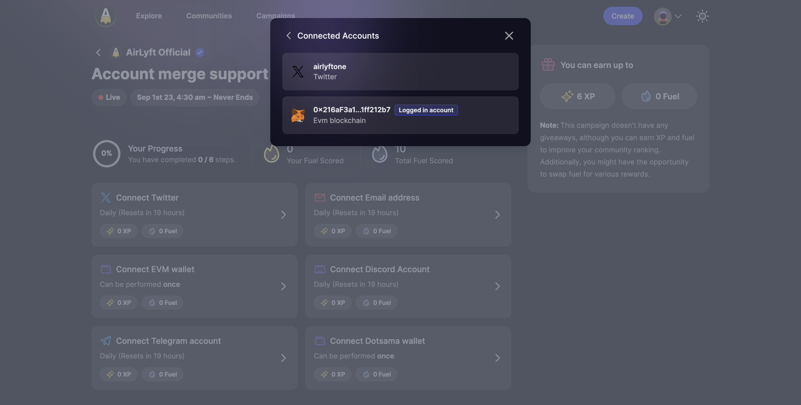

# Merging Two Users

Use this guide when you have created two different users and want to merge them into one. Please note your XP, Fuel etc. will not be merged and if you have performed a quest already then you will not be able to perform the same quest again from the same account etc.

<iframe width="100%" src="https://www.youtube.com/embed/Okfi_-_ZP0M?si=p8VFg3qzc4vwryJt" title="YouTube video player" frameborder="0" allow="accelerometer; autoplay; clipboard-write; encrypted-media; gyroscope; picture-in-picture; web-share" allowfullscreen></iframe>

### Difference Between User and Account
A user can have multiple accounts and will have one "Logged In Account". Account is the authentication method (like wallet, twitter, email etc.) that you use 

### Logged In Account
Your "Logged In" account is the authentication method you use to sign in to your account on AirLyft. You can find your primary account by clicking on your display picture, going to settings and clicking on "Connected Accounts".

In the image above there is a user that has two accounts:
1. The Twtter Account _airlyftone_ is a connected account to your user
1. The Metamask Address _0x216aF3a1...1ff212b7_ is your Logged In Account

Now let's say you have two users:
1. **User 1**: Has a logged in account _0x123_ (Can be your Wallet, Twitter, Email or any other authentication way)
1. **User 2**: Has a logged in account _airlyftone_ (Can be your Wallet, Twitter, Email or any other authentication way)

And you want to merge both the users. Let's say you want to merge the **User 1** into **User 2**.

### Step 1: Change the logged in account of User 1
1. Visit the page [account merge support](https://airlyft.one/community/account-merge-support)
1. Log in to **User 1** through the account _0x123_
1. Now, connect a different account, perhaps a dummy metamask wallet or email address, say a burner wallet like _0x555_ 
1. Log out of your account
1. Log back in, but this time from _0x555_ and not _0x123_
1. Go to Profile > Settings > Connected Account, you will see the burner wallet _0x555_ marked as the Logged In Account and not _0x123_
1. Log out

Note: This will work similarly for Twitter, Email etc. The main purpose of this step is to change your "Logged In Account" to a burner wallet.

### Step 2: Move the account to User 2
1. Visit the page [account merge support](https://airlyft.one/community/account-merge-support) again
1. This time, log in to **User 2** with your twitter _airlyftone_
1. Now, coneect the account that you want to move. In our case we want to move the wallet account _0x123_ so we will connect that account
1. As long as _0x123_ is not the "Logged In Account" account of User 1, you will be able to move it successfully yo User 2.

With the two steps above, you will be able to move the wallet account _0x123_ from User 1 to User 2.
