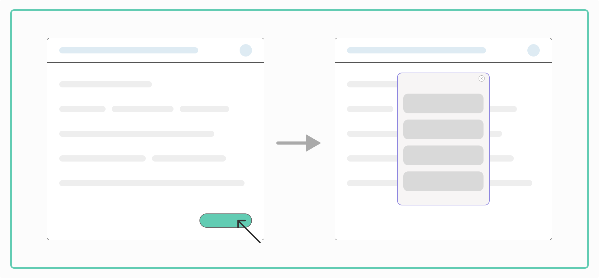

# Installation

Installing the AirLyft Widget on your website is quick and easy. Simply insert the JavaScript code into your website’s code.

1. First get your `widgetId` by following the steps mentioned [here](#creation).
2. Choose your widget style and variation.
3. Add the respective script to the `<body>` of your website.

## Creation

Follow the steps given below to get your `widgetId`:

1. Edit your campaign on [AirLyft Dashboard](https://account.airlyft.one), and select the `Widgets` tab.

2. Click on the `Create Widget` button.


3. Fill in the details, like the domain you are using the widget on, theme, and primary color. You can also customize all the colors by opening the **Customize Colors** option.


4. After filling in all the details, click on **Create Widget**.

5. You can then get your `widgetId` from the displayed script.

## Sidebar Widget


The Sidebar Widget opens a panel on the side of your webpage, providing a non-intrusive way to engage users.

### Simple Sidebar

- Basic implementation that opens a sidebar through a button click
- Ideal for general onboarding flows and information display

Copy the code below for a simple sidebar (replace YOUR-WIDGET-ID with the ID you generated):

```
<script src="https://assets.airlyft.one/widget/widget.js"></script>
<script>
  (async () => {
      try {
          const widget = await window.AirlyftWidget("YOUR-WIDGET-ID");
          widget.createSidebar({});
      } catch (err) {
          console.error(err)
      }
    })();
</script>
```

### Open Quest Directly Sidebar

- Opens a specific quest directly in the sidebar
- Perfect for targeted user engagement and guided experiences

Copy the code below for an open quest directly sidebar (replace YOUR-WIDGET-ID with the ID you generated, and TASK-ID with your task's ID):

```
<script src="https://assets.airlyft.one/widget/widget.js"></script>
<script>
  (async () => {
      try {
          const widget = await window.AirlyftWidget("YOUR-WIDGET-ID");
          const instance = await widget.createSidebar({});
          widget.openSpecificTask(instance, "TASK-ID");
      } catch (err) {
          console.error(err)
      }
    })();
</script>
```

### Async Script Load Sidebar

- Loads the widget script asynchronously in the background
- Improves website performance by not blocking other page elements from loading

Copy the code below for an async script load sidebar (replace YOUR-WIDGET-ID with the ID you generated):

```
<script
      src="https://assets.airlyft.one/widget/widget.js"
      async
      onload="window.InitAirlyft()">
</script>
<script>
      window.InitAirlyft = async () => {
        try {
          const widget = await window.AirlyftWidget("YOUR-WIDGET-ID");
          widget.createSidebar({});
        } catch (err) {
          console.error(err);
        }
      };
</script>
```

## Popup Widget



The Popup Widget appears as a modal window over your webpage, creating a focused interaction space.

### Simple Popup

- Basic implementation that opens a popup through a button click
- Suitable for announcements, promotions, or brief interactions

Copy the code below for a simple popup (replace YOUR-WIDGET-ID with the ID you generated):

```
<script src="https://assets.airlyft.one/widget/widget.js"></script>
<script>
  (async () => {
      try {
          const widget = await window.AirlyftWidget("YOUR-WIDGET-ID");
          widget.createModal({});
      } catch (err) {
          console.error(err)
      }
    })();
</script>
```

### Open Quest Directly Popup

- Opens a specific quest directly in the popup
- Ideal for immediate user engagement with particular content or tasks

Copy the code below for an open quest directly popup (replace YOUR-WIDGET-ID with the ID you generated, and TASK-ID with your task's ID):

```
<script src="https://assets.airlyft.one/widget/widget.js"></script>
<script>
  (async () => {
      try {
          const widget = await window.AirlyftWidget("YOUR-WIDGET-ID");
          const instance = await widget.createModal({});
          widget.openSpecificTask(instance, "TASK-ID");
      } catch (err) {
          console.error(err)
      }
    })();
</script>
```

### Async Script Load Popup

- Loads the widget script asynchronously in the background
- Enhances page load times and overall site performance

Copy the code below for an async script load popup (replace YOUR-WIDGET-ID with the ID you generated):

```
<script
      src="https://assets.airlyft.one/widget/widget.js"
      async
      onload="window.InitAirlyft()">
</script>
<script>
      window.InitAirlyft = async () => {
        try {
          const widget = await window.AirlyftWidget("YOUR-WIDGET-ID");
          widget.createModal({});
        } catch (err) {
          console.error(err);
        }
      };
</script>
```

## Inline Widget

Coming Soon

## Caveats

The AirLyft Widget is currently in Pre-Release mode. Please note the following caveats when using the platform:

1. Currently, PolkadotJS does not work for login or quests. Ask users to use Subwallet or Talisman for Substrate-based actions.
